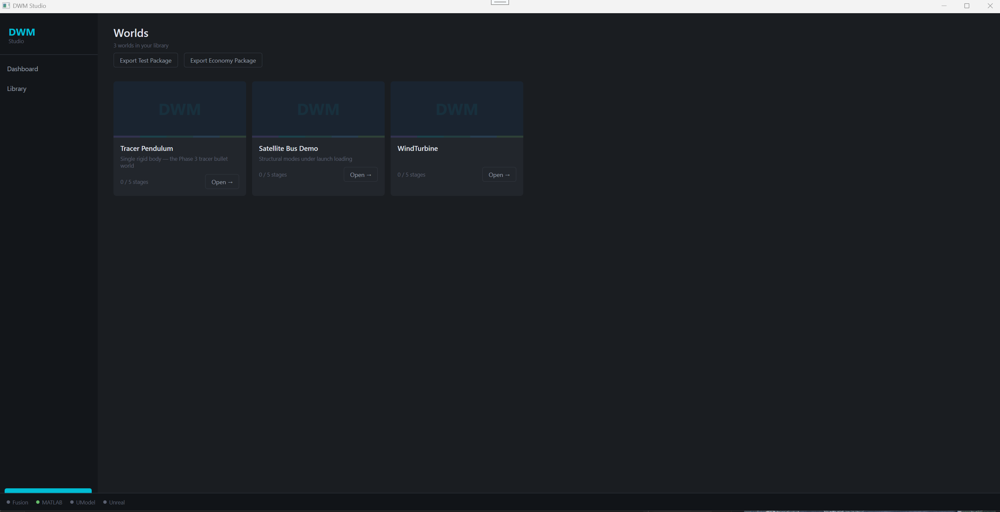
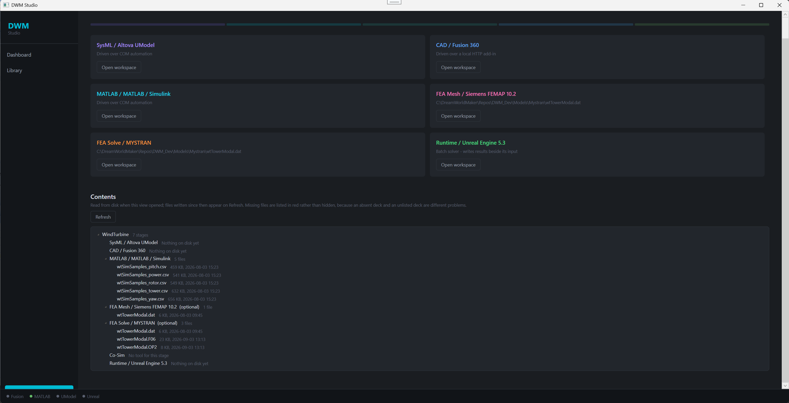
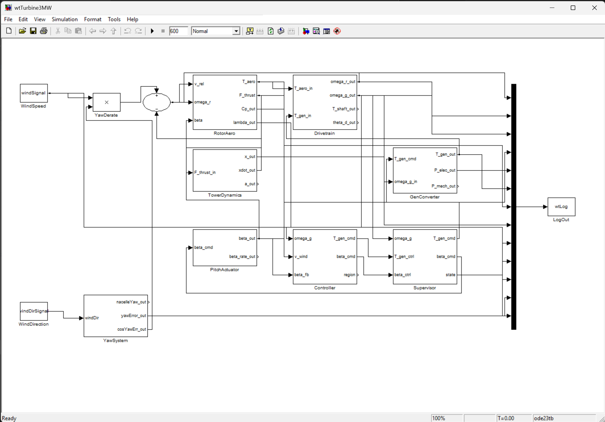
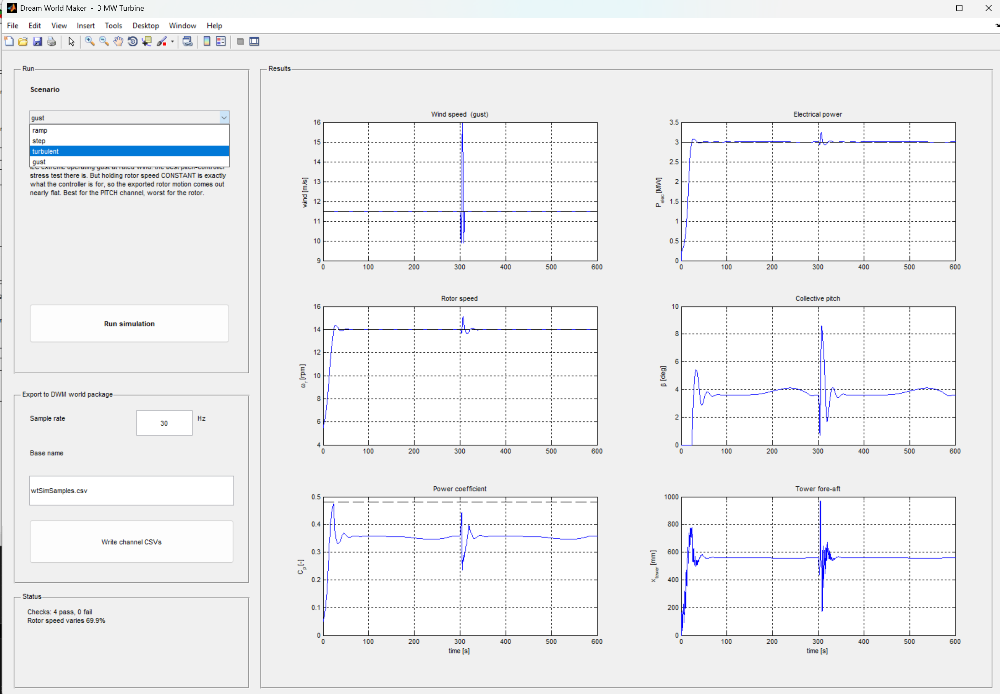
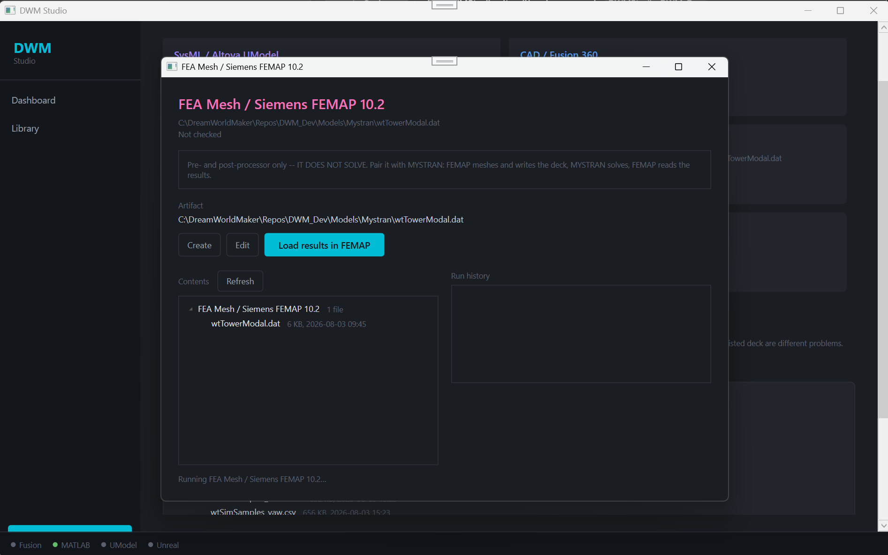
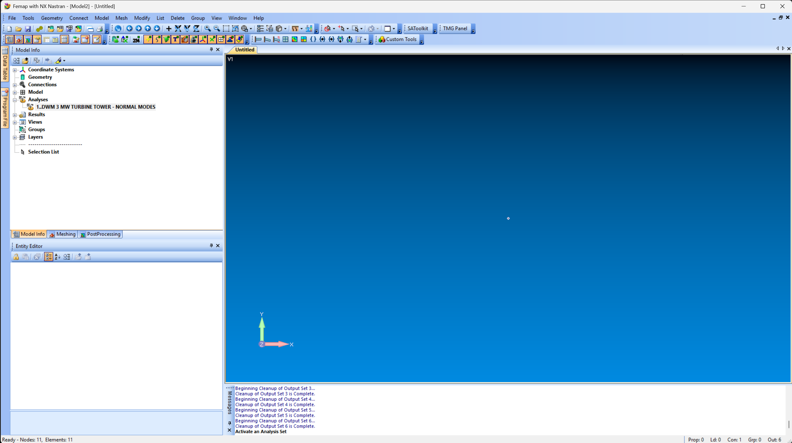
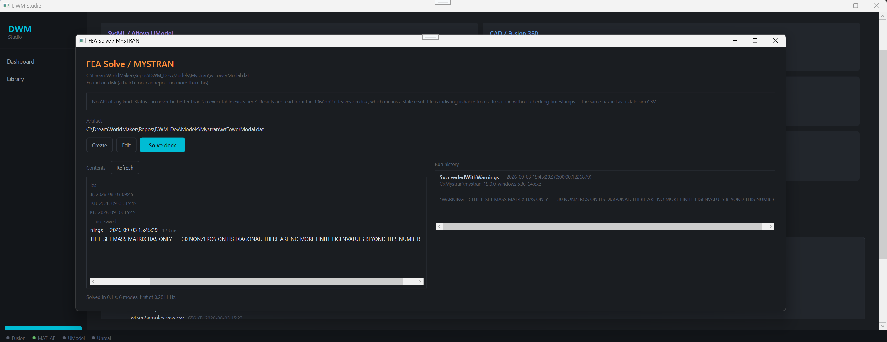
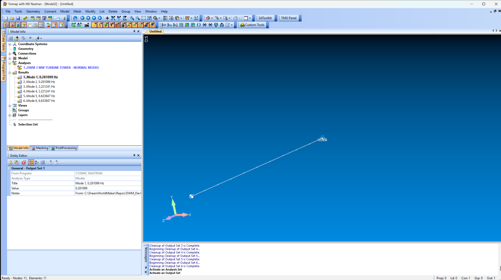

# DWM Studio — Tutorial

Taking the Mountain's turbine from a Simulink model to a solved tower, using the
three engineering stages that are wired up today: **MATLAB / Simulink**,
**FEA Mesh / Siemens FEMAP**, and **FEA Solve / MYSTRAN**.

By the end you will have run a turbine simulation, exported its motion as channel
CSVs the game can play back, meshed a tower, solved it for its natural
frequencies, and read the mode shapes back.

---

## 1. The Library

DWM Studio opens on your **Library** — the worlds you have, and nothing else.



A **world** is one thing being engineered, with its own set of stages. Three ship
with the project:

| World | What it is |
|---|---|
| **Tracer Pendulum** | Single rigid body — the Phase 3 tracer bullet world |
| **Satellite Bus Demo** | Structural modes under launch loading |
| **WindTurbine** | The Mountain's 3 MW turbine — the subject of this tutorial |

Each card carries a completion counter, `0 / 5 stages`. Note that the project page
in the next section enumerates *seven* stages for WindTurbine — two of them, the FEA
Mesh and FEA Solve stages, are marked `(optional)`, which accounts for the
difference. So the counter tracks the five required stages, and you can finish a
world without ever touching FEA.

The two buttons at the top — **Export Test Package** and **Export Economy
Package** — write world packages for the runtime. They are the handoff to Unreal,
not part of the engineering loop below.

> **Close the Studio before Unreal opens a world package.** The exporter deletes and
> recreates the `.db`; the handoff is sequential by design, not concurrent. See
> `RUNBOOK.md` §4 and `ARCH.md`.

`Open →` on **WindTurbine** to follow along.

---

## 2. The project page

Each project is a row of **stages**, and each stage is one tool with one job.



Two halves to this screen, and the second is the one that matters day to day.

**The cards** are the tools. Each says how it is driven, because that governs how
much the Studio can actually know about it: SysML/UModel and MATLAB are driven over
**COM automation**, Fusion 360 over **a local HTTP add-in**, and MYSTRAN is a
**batch solver** with no API at all — it just leaves files on disk. `Open workspace`
opens that stage.

**The Contents tree** is what is on disk, per stage, read when the view opened.
`Refresh` re-reads it. Missing files are listed in red rather than hidden, which is
deliberate: *an absent deck and an unlisted deck are different problems*, and hiding
the first makes it look like the second.

The dots along the bottom — Fusion, MATLAB, UModel, Unreal — show which tools are
live. A green dot means the Studio has a working connection to that application.

> **Stages are independent.** Nothing forces you to work left to right. The turbine
> below uses MATLAB and the two FEA stages; SysML, CAD and Runtime read
> "Nothing on disk yet" throughout and that is a perfectly normal state.

---

## 3. MATLAB / Simulink — running the turbine

`Open workspace` on the MATLAB card brings up Simulink over COM. The model is
`wtTurbine3MW`.



The signal path runs left to right:

| Block | What it does |
|---|---|
| `WindSpeed`, `WindDirection` | Scenario inputs |
| `YawDerate` | Cuts available wind by yaw misalignment |
| `RotorAero` | Aerodynamic torque and thrust, and the power coefficient `Cp` |
| `Drivetrain` | Rotor and generator speeds, shaft torque |
| `TowerDynamics` | Fore-aft deflection from rotor thrust |
| `GenConverter` | Generator torque, electrical and mechanical power |
| `PitchActuator` | Blade pitch, rate-limited |
| `Controller` / `Supervisor` | Torque and pitch commands, and the operating region |
| `YawSystem` | Nacelle yaw and yaw error |
| `LogOut` → `wtLog` | Everything above, logged for export |

Note the two feedback paths, which are what make this a control problem rather than
a lookup: `Drivetrain` returns `omega_r` to `RotorAero`, and `Controller` feeds
`beta_cmd` back through `PitchActuator`. The solver is **ode23tb** over **600 s**.

### The run app

The Studio drives the model through a MATLAB app rather than the bare model, so a
run is one button and the export is reproducible.



**Pick a scenario** — `ramp`, `step`, `turbulent`, or `gust` — then **Run
simulation**. Six plots come back: wind speed, electrical power, rotor speed,
collective pitch, power coefficient, and tower fore-aft deflection.

The run above is `gust`: the IEC extreme operating gust at rated wind, and you can
read the whole control story off it. The gust hits at t≈300 s. Electrical power
barely moves off 3 MW, rotor speed barely moves off 14 rpm, and pitch spikes from
4° to 8.5° to make that true. The tower rings and settles.

**Which is why the app warns you about `gust` for export.** Holding rotor speed
constant is exactly what the controller is for, so the exported *rotor* motion
comes out nearly flat — the best scenario for the pitch channel and the worst for
the rotor. Choose the scenario to suit the channel you care about; `turbulent`
gives the liveliest rotor.

**Status** reports checks and a spread figure: `Checks: 4 pass, 0 fail` and
`Rotor speed varies 69.9%`. That percentage is the useful one before exporting —
a channel that barely varies will animate as though nothing is happening.

### Exporting to the world package

Set a **sample rate** (30 Hz suits playback) and a **base name**, then
**Write channel CSVs**. You get one file per channel:

```
wtSimSamples_pitch.csv    wtSimSamples_power.csv    wtSimSamples_rotor.csv
wtSimSamples_tower.csv    wtSimSamples_yaw.csv
```

Those land in the project's MATLAB stage folder and appear in the Contents tree on
`Refresh`. They are what the runtime plays back, so the turbine in the game is
moving to solver output rather than to a canned animation.

---

## 4. FEA Mesh / FEMAP — building the deck

The tower needs its own analysis. Open the FEMAP stage.



Read the notice first, because it is the single most important thing about this
stage:

> **Pre- and post-processor only — IT DOES NOT SOLVE.** Pair it with MYSTRAN:
> FEMAP meshes and writes the deck, MYSTRAN solves, FEMAP reads the results.

So FEMAP appears **twice** in your workflow, on either side of the solver. The
artifact both stages point at is the deck:

```
C:\DreamWorldMaker\Repos\DWM_Dev\Models\Mystran\wtTowerModal.dat
```

`Create` writes a new deck, `Edit` opens the existing one, and
`Load results in FEMAP` is the post-processing half — use that *after* MYSTRAN has
run, not before.

In FEMAP itself the analysis is set up as a normal-modes run:



Under **Analyses** you can see `1..DWM 3 MW TURBINE TOWER - NORMAL MODES`. The
status bar reads `Nodes: 11, Elements: 11` — this is a beam model of the tower, not
a shell mesh. Eleven elements is enough for the first few bending modes and solves
in a fraction of a second, which is the right trade for a game asset.

`Results` is empty at this point. That is correct: FEMAP has not solved anything,
and will not.

---

## 5. FEA Solve / MYSTRAN — solving it

Back in the Studio, open the MYSTRAN stage and press **Solve deck**.



The notice here is a warning about what the Studio can and cannot tell you:

> No API of any kind. Status can never be better than "an executable exists here".
> Results are read from the `.f06`/`.op2` it leaves on disk, which means **a stale
> result file is indistinguishable from a fresh one without checking timestamps** —
> the same hazard as a stale sim CSV.

Take that seriously. If a solve fails and you read the results anyway, you will be
looking at the previous run's numbers with nothing on screen to tell you. Check the
timestamps in the Contents tree against the run you just did.

**Run history** records each attempt with its outcome, duration and the executable
used. Here:

```
SucceededWithWarnings — 2026-09-03 19:45:29Z (0:00:00.12)
C:\Mystran\mystran-19.0.0-windows-x86_64.exe

*WARNING : THE L-SET MASS MATRIX HAS ONLY 30 NONZEROS ON ITS DIAGONAL.
           THERE ARE NO MORE FINITE EIGENVALUES BEYOND THIS NUMBER
```

That warning is expected for a model this size and is not a failure. It says the
mass matrix supports 30 finite eigenvalues, so asking for more would return
nothing — with 11 beam elements you are nowhere near that ceiling.

The footer gives the short version: **`Solved in 0.1 s. 6 modes, first at 0.2811 Hz.`**

---

## 6. Reading the results back

Return to the FEMAP stage and press **Load results in FEMAP**.



**Results** is now populated, and the Entity Editor shows where each output set came
from — `From Program: COSMIC NASTRAN`, `Analysis Type: Modes`, with the source path
in `Notes`. Six modes:

| Mode | Frequency |
|---|---|
| 1, 2 | 0.281099 Hz |
| 3, 4 | 2.221241 Hz |
| 5, 6 | 6.633947 Hz |

**The pairs are the physics, not a bug.** The tower is axisymmetric, so every
bending mode exists twice — once fore-aft, once side-to-side — at the same
frequency. Seeing them come out paired is a sign the model is behaving; seeing them
split would mean something has made the tower stiffer in one direction.

Selecting a mode shows its deformed shape against the undeformed beam.

### A check worth doing by hand

The Studio does not compare stages for you, so this one is yours: the Simulink
`TowerDynamics` block carries its own fore-aft frequency, and MYSTRAN has just
computed one from the geometry — **0.2811 Hz**. If those two disagree, the tower
ringing you exported in `wtSimSamples_tower.csv` is not the tower you just analysed.

That is the whole reason both stages exist in one project.

---

## 7. What comes next

`Co-Sim` reads **"No tool for this stage"** and `Runtime / Unreal Engine 5.3` reads
**"Nothing on disk yet"** until you export a world package to it. The channel CSVs
from §3 are what the runtime consumes, and the export buttons on the Library screen
are how the package gets written.

---

## Quick reference

| Stage | Tool | Driven by | Produces |
|---|---|---|---|
| SysML | Altova UModel | COM automation | Model files |
| CAD | Fusion 360 | Local HTTP add-in | Geometry |
| MATLAB | MATLAB / Simulink | COM automation | `wtSimSamples_*.csv` |
| FEA Mesh *(optional)* | Siemens FEMAP 10.2 | Manual / file | `wtTowerModal.dat` |
| FEA Solve *(optional)* | MYSTRAN | Batch executable | `.f06`, `.op2` |
| Co-Sim | — | — | — |
| Runtime | Unreal Engine 5.3 | World package | The playable build |

### Things that will catch you out

- **FEMAP does not solve.** If Results is empty, you have not run MYSTRAN yet.
- **Stale results look exactly like fresh ones.** MYSTRAN leaves files on disk and
  the Studio cannot tell you how old they are. Check timestamps.
- **`gust` flattens the rotor channel.** Good for pitch, poor for rotor motion —
  pick the scenario per channel.
- **Close the Studio before Unreal opens the world package.** The exporter deletes
  and recreates the `.db`; the handoff is sequential by design, not concurrent.
  See `RUNBOOK.md` §4 and `ARCH.md`.
